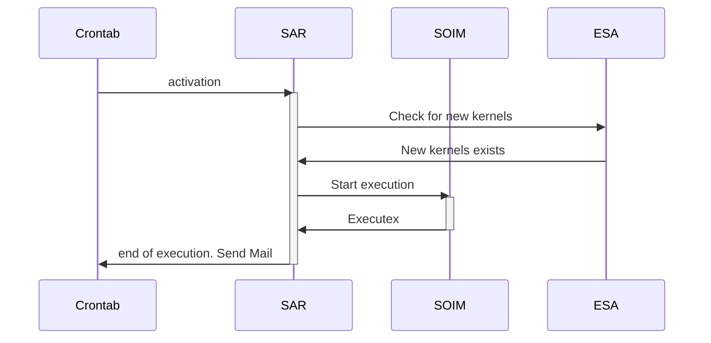

# SOIM

```mermaid
sequenceDiagram
    participant C as Crontab
    participant SAR
    participant SOIM
    participant ESA
    C ->>SAR: activation
    activate SAR
    SAR ->>ESA: Check for new kernels
    ESA ->> SAR: New kernels exists
    SAR ->> SOIM: Start execution
    activate SOIM
    SOIM ->> SAR: Executex
    deactivate SOIM
    SAR ->> C: end of execution. Send Mail
    deactivate SAR
```