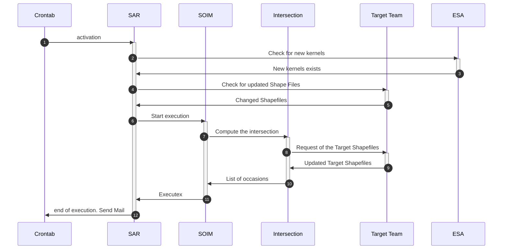

# SOIM

```mermaid
sequenceDiagram
    participant C as Crontab
    participant SAR
    participant SOIM
    participant ESA
    C ->>SAR: activation
    activate SAR
    SAR ->>ESA: Check for new kernels
    activate ESA
    ESA ->> SAR: New kernels exists
    deactivate ESA
    SAR ->> SOIM: Start execution
    activate SOIM
    SOIM ->> SAR: Executex
    deactivate SOIM
    SAR ->> C: end of execution. Send Mail
    deactivate SAR
```

## Future Version

```mermaid
sequenceDiagram
    autonumber
    participant C as Crontab
    participant SAR
    participant SOIM
    participant I as Intersection
    participant T as Target Team
    participant ESA
    C ->>SAR: activation
    activate SAR
    SAR ->>ESA: Check for new kernels
    activate ESA
    ESA ->> SAR: New kernels exists
    deactivate ESA
    SAR ->> T: Check for updated Shape Files
    activate T
    T ->> SAR: Changed Shapefiles
    deactivate T
    SAR ->> SOIM: Start execution
    activate SOIM
    SOIM ->> I: Compute the intersection
    activate I
    I ->> T: Request of the Target Shapefiles
    activate T
    T ->> I: Updated Target Shapefiles
    deactivate T
    I ->> SOIM: List of occasions
    deactivate I
    SOIM ->> SAR: Executex
    deactivate SOIM
    SAR ->> C: end of execution. Send Mail
    deactivate SAR
```